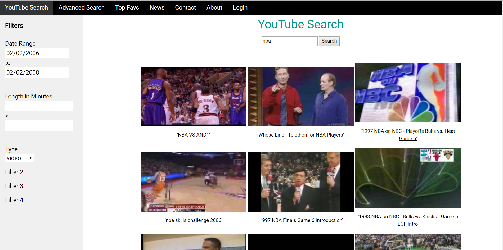
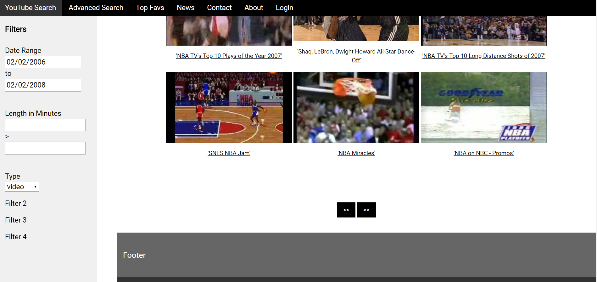

# YouTube Advanced Search
Advanced searches that cannot be done on the main YouTube site. Takes advantage of YouTube Data API. Uses Node.js and Express.js. Currently being developed.

# Running
1. Make sure Node.js v8.11.1 is installed (node -v).
2. Install packages
    - npm install express --save
    - npm install body-parser
    - youtube-node
3. Start the application with "node server.js".
4. Open “http://localhost:3000” in browser.

# Status
Search results display on multipled pages using page tokens. Searching, date filter (ex. 2/4/2014 - 5/3/2017), and type filter works. Working on specific time filter.

# Future Plans
2. Order by thumb up / down ratio
3. Filter by specific time length (ex. < 7 min)   (WORKING ON)
4. Search 3D videos
5. Search by language

# Screens

